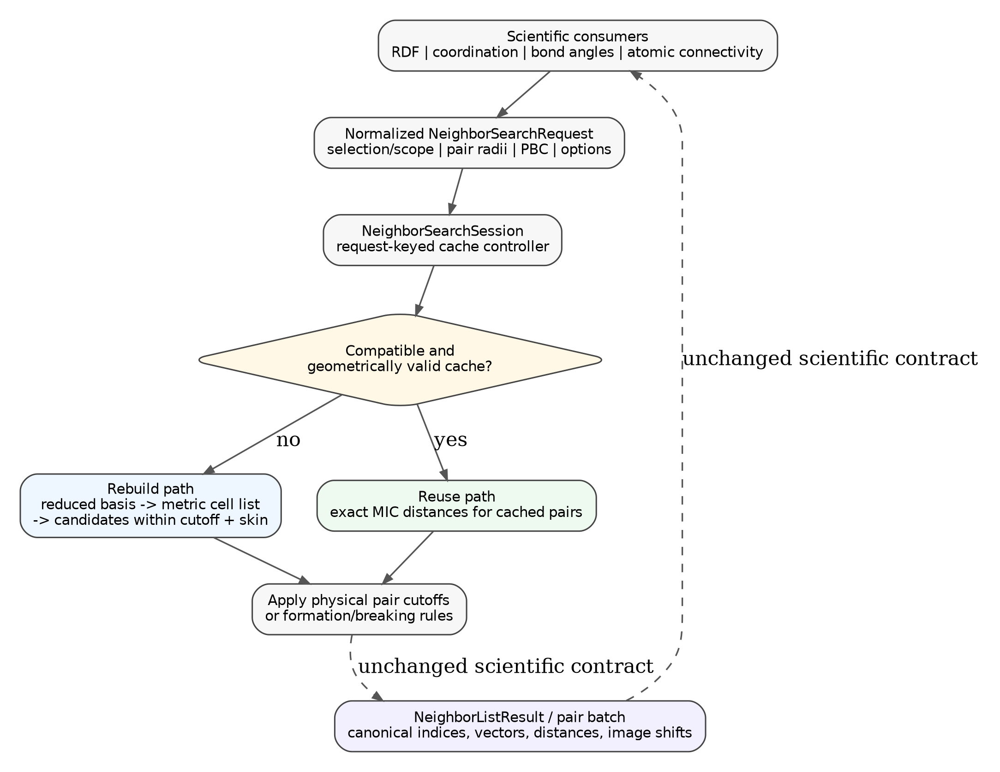
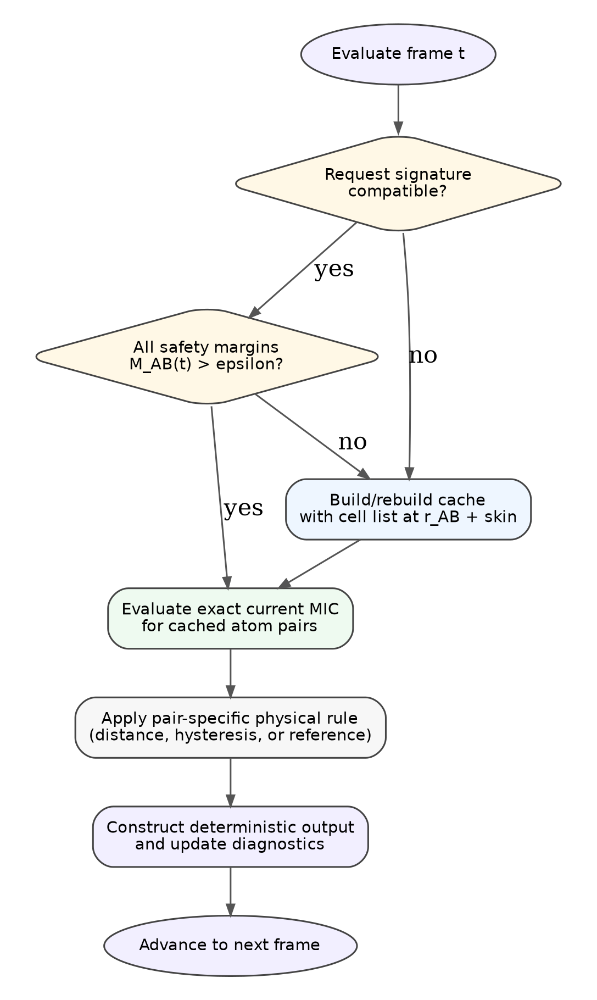
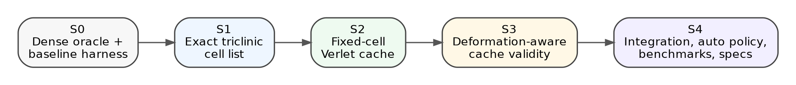

# Purpose and status

This document records the accepted high-level plan for replacing the current
blocked dense neighbor search in `mdstats` with an exact periodic cell-list
backend and a trajectory-aware Verlet candidate cache.

The plan is intentionally staged. Each stage must be independently testable and
must preserve the existing scientific neighbor contract before the next stage is
started. The document is a design and implementation reference, not yet a final
module specification. Detailed function signatures may be refined during each
stage, but the mathematical invariants, ownership boundaries, and acceptance
gates in this document should remain stable unless an explicit revision is made.

The optimization is motivated by the current per-frame scaling

$$
T_{\mathrm{dense}}
\sim
\sum_{(A,B)\in\mathcal C} n_A n_B,
$$

where $\mathcal C$ is the set of registered species pairs and $n_A$ is the
number of atoms of species $A$ in the active scope. Species pruning and NumPy
vectorization reduce the constant factor, but the worst-case work remains
quadratic in system size.

The target architecture should approach linear work at fixed density and finite
cutoff:

$$
T_{\mathrm{target}}
\sim
O(N z_{\mathrm{list}}),
$$

where $z_{\mathrm{list}}$ is the average number of cached candidates per atom
inside the physical cutoff plus skin.


# Theoretical background

## Periodic configuration space

A periodic cell with row-vector matrix $H$ generates the lattice

$$
\mathcal L=\{\mathbf nH:\mathbf n\in\mathbb Z^3\}.
$$

Cartesian points that differ by a lattice vector represent the same physical
point under periodic boundary conditions. Fractional coordinates therefore live
on the quotient space

$$
\mathbb R^3/\mathbb Z^3,
$$

which is a three-dimensional torus when all axes are periodic. A pair displacement
is not one vector but the equivalence class

$$
\Delta\mathbf r(\mathbf n)
=
(\mathbf s_j-\mathbf s_i+\mathbf n)H.
$$

The minimum-image distance is the closest-vector problem

$$
r_{ij}
=
\min_{\mathbf n\in\mathbb Z^3}
\left\|(\mathbf s_j-\mathbf s_i+\mathbf n)H\right\|.
$$

For skewed cells, componentwise rounding of fractional coordinates is not a
general solution to this minimization. The cell metric

$$
G=HH^{\mathsf T}
$$

encodes the full geometry through

$$
\|\Delta\mathbf r\|^2
=
\Delta\mathbf s\,G\,\Delta\mathbf s^{\mathsf T}.
$$

## The cutoff graph is the scientific object

For a physical cutoff $r_c$, the neighbor relation defines a graph

$$
E(r_c)
=
\left\{(i,j,\mathbf m_{ij}):r_{ij}<r_c\right\}.
$$

Dense search, cell lists, and Verlet caches are alternative algorithms for
constructing the same graph. Acceleration is scientifically valid only when it
preserves every accepted pair, distance, displacement vector, and periodic image
shift. The dense $O(N^2)$ calculation is therefore retained as an oracle even
after faster backends are introduced.

At fixed number density and finite cutoff, the expected number of physical
neighbors per atom remains bounded. The computational target is consequently

$$
O(Nz),
$$

where $z$ is the mean local candidate count, rather than testing all
$N(N-1)/2$ pairs.

## Spatial factorization by linked cells

The linked-cell method partitions space into bins and searches only bin pairs
that can approach within the list radius. Its classical lineage begins with
Quentrec and Brot [1]. In an orthogonal box, nearby bins can be enumerated by a
simple Cartesian stencil. In a triclinic cell, fractional bin offsets must be
judged using the metric $G$.

For a pair of bins, let $B\subset\mathbb R^3$ be the box of possible fractional
differences between points in those bins. The exact question is

$$
\min_{\Delta\mathbf s\in B}
\Delta\mathbf s\,G\,\Delta\mathbf s^{\mathsf T}
< R^2.
$$

If the lower bound is at least $R^2$, the bin pair cannot contain a candidate and
may be skipped. Otherwise it must be searched. This is the mathematical role of
the metric-aware stencil: it proves exclusion rather than guessing a fixed set
of neighboring bin indices.

A reduced lattice basis can make the search representation more compact, but the
physical result must be reconstructed in the original cell basis. Basis reduction
changes efficiency, not the periodic structure being analyzed.

## Temporal coherence and the Verlet skin

Molecular trajectories are continuous in time, so the neighbor graph usually
changes much more slowly than the coordinates. The Verlet method [2] exploits
this by building a candidate list at the enlarged radius

$$
R=r_c+r_{\mathrm{skin}}.
$$

At later frames, exact current distances are recomputed only for cached
candidates and filtered by the physical cutoff $r_c$. A pair absent from the
candidate list was separated by at least $R$ at rebuild time. In a fixed cell,
if every atom has moved by at most $d_{\max}$, two omitted atoms can approach by
at most $2d_{\max}$. Completeness is therefore guaranteed while

$$
2d_{\max}<r_{\mathrm{skin}},
$$

up to the explicit numerical tolerance. Automatic displacement-triggered list
updating belongs to the established Verlet-list literature [3].

The cache is not a stored bond graph. It is a conservative superset of possible
neighbors, and every reused frame still undergoes an exact minimum-image cutoff
test.

## Deforming cells: affine and nonaffine motion

For a rebuild cell $H_0$ and current cell $H_t$, the row-vector deformation map is

$$
F_t=H_0^{-1}H_t.
$$

An atom position can be decomposed as

$$
\mathbf r_i(t)=\mathbf r_i(0)F_t+\mathbf u_i(t),
$$

where the first term is affine cell deformation and $\mathbf u_i$ is nonaffine
atomic motion. The smallest singular value supplies a global contraction bound,

$$
\|\mathbf xF_t\|
\ge
\sigma_{\min}(F_t)\|\mathbf x\|.
$$

For a pair type $A,B$, an omitted rebuild pair at distance at least
$r_{AB}+r_{\mathrm{skin}}$ remains outside the physical cutoff if

$$
\sigma_{\min}(F_t)(r_{AB}+r_{\mathrm{skin}})
-u_A^{\max}(t)-u_B^{\max}(t)
>r_{AB}.
$$

This is the basis of the implemented deformation-aware margin. The use of a
global singular-value contraction bound together with species-resolved
nonaffine displacement maxima is an `mdstats` derivation. Published work on
general and deforming periodic neighbor searches [4-7] supplies important prior
context but not this exact theorem.

## Exactness, conservatism, and performance

The subsystem follows three distinct principles:

- **exactness:** no valid physical neighbor may be omitted;
- **conservatism:** uncertain bin pairs or cache states fall back to more work,
  not fewer candidates;
- **performance:** reduced bases, spatial bins, and temporal reuse lower cost only
  after exactness is established.

This hierarchy explains why the architecture retains dense comparison tests,
explicit fallback events, and complete provenance. A faster candidate generator
is acceptable only when the final neighbor graph is indistinguishable from the
dense definition.

# Implementation status

| Stage | Status | Package | Notes |
|---|---|---|---|
| S0 | Complete | `0.14.0a0` | Dense backend made explicit; immutable results, canonical comparison utilities, randomized scalar-oracle tests, and baseline benchmarks added. |
| S1 | Complete | `0.14.0a1` | Exact single-frame triclinic cell-list backend; optional reduced search basis, perpendicular-height bins, exact metric stencil, original-basis MIC output, and dense-equivalence benchmark. |
| S2 | Complete | `0.14.0a2` | Request-keyed fixed-cell Verlet candidate cache, exact current MIC reuse, cache statistics, and one-pass nested connectivity thresholds. |
| S3 | Complete | `0.14.0a3` | Explicit singular-value and species-aware nonaffine deformation bound, rigid-rotation reuse, condition-number validation, and variable-cell equivalence tests. |
| S4 | Complete | `0.14.1` | Public policy integration, deterministic automatic selection, semantics-aware cache resolution, repeated-zero-reuse shutoff, exact fallback, unified diagnostics, representative benchmarks, and release validation. |

Stages S0-S4 are complete. The exact dense backend remains the scientific oracle, while the public `NeighborSearchOptions` policy selects dense or cell-list execution and enables request-keyed Verlet reuse for multi-frame cell-list workloads. RDF, coordination, bond angle, and every distance-based connectivity mode share this policy and emit the same diagnostic schema. Explicit dense and cell-list overrides remain available, and every automatic fallback is exact and recorded.

# Accepted scope and constraints

## Fixed atom-population promise

`AtomisticFrameCollection` provides the fixed-population promise required by the
cache:

- every frame contains the same number of atoms;
- canonical atom indices are stable;
- persistent source IDs are stable when available;
- species and masses are stable at each canonical atom index;
- periodic-boundary flags are stable within the collection;
- coordinates and cells may vary from frame to frame;
- atomic connectivity and framework topology may change.

The neighbor subsystem may therefore cache candidate pairs by canonical atom
index. It must not assume that geometry, connectivity, or phase remains fixed.

## Scientific contract remains unchanged

Scientific consumers specify **what** neighborhood they need. The neighbor
subsystem decides **how** to obtain it.

Consumers include:

- pair RDF;
- coordination distributions;
- bond-angle distributions;
- atomic connectivity;
- future local-environment and topology modules.

These modules must not own:

- cell-list construction;
- lattice reduction;
- skin-distance validity tests;
- cache rebuild decisions;
- request-signature hashing;
- reduced-basis image-shift conversion.

They continue to consume the same conceptual output:

```text
canonical atom indices
minimum-image vectors
minimum-image distances
periodic image shifts
CSR or equivalent pair grouping
```

## Dense backend is retained

The existing blocked dense search remains permanently available as:

- a correctness oracle;
- an efficient backend for small systems;
- a fallback for unsupported or pathological geometries;
- a regression reference for every optimized backend.

The optimized implementation must never remove the ability to force the dense
backend explicitly.

# Current baseline

The current private neighbor kernel performs the following work for each frame:

1. resolve active atom selections and species-pair cutoffs;
2. loop over registered species pairs;
3. form dense center-candidate displacement blocks;
4. apply periodic minimum-image geometry vectorially;
5. filter distances by the strict physical cutoff;
6. return a compact CSR-like result.

Its strengths are:

- deterministic behavior;
- exact frame-local minimum-image geometry;
- orthogonal and triclinic support through the existing MIC operation;
- species and scope pruning;
- bounded temporary memory through center blocking;
- compact accepted-neighbor storage.

Its limitations are:

- dense candidate generation for every registered species pair;
- no spatial cell list;
- no candidate reuse between frames;
- two separate geometric scans in the current hysteretic and reference paths;
- no diagnostics for candidate efficiency or rebuild frequency.

The new design must preserve the strengths while replacing candidate generation
and trajectory reuse.

# Target subsystem architecture

{ width=88% }

The intended ownership boundary is:

```text
scientific module
    |
    v
normalized neighbor request
    |
    v
persistent NeighborSearchSession
    |
    +--> compatible valid cache: evaluate cached pairs
    |
    `--> no valid cache: rebuild with exact cell list
    |
    v
apply physical cutoff or connectivity rule
    |
    v
unchanged neighbor result contract
```

The session owns one or more caches keyed by normalized request signature. The
initial implementation should use one cache per exact request signature rather
than attempting cross-analysis superset sharing.

# Mathematical conventions

## Cell and coordinate convention

The three lattice vectors are rows of the cell matrix

$$
H=
\begin{pmatrix}
\mathbf a^{\mathsf T}\\
\mathbf b^{\mathsf T}\\
\mathbf c^{\mathsf T}
\end{pmatrix}.
$$

Fractional row vectors map to Cartesian coordinates by

$$
\mathbf r=\mathbf sH.
$$

A periodic image displacement from atom $i$ to atom $j$ is

$$
\mathbf d_{ij}
=
\left(\mathbf s_j-\mathbf s_i+\mathbf m_{ij}\right)H,
$$

where $\mathbf m_{ij}\in\mathbb Z^3$ is zero along nonperiodic axes.

All final accepted vectors, distances, and image shifts must be derived from the
same exact minimum-image operation.

## Strict cutoff convention

A physical neighbor satisfies

$$
r_{ij}<r_{AB},
$$

not $r_{ij}\le r_{AB}$. The strict relation is part of the existing neighbor
contract and must remain unchanged.

## Metric tensor

The fractional-space metric is

$$
G=HH^{\mathsf T},
$$

so that

$$
\lVert\Delta\mathbf r\rVert^2
=
\Delta\mathbf s\,G\,\Delta\mathbf s^{\mathsf T}.
$$

The off-diagonal elements of $G$ encode cell skew. They are the reason that a
hard-coded nearest-bin stencil is unsafe for general triclinic cells.

# Algorithmic provenance and attribution boundaries

The architecture combines several established algorithmic lineages:

- Quentrec and Brot's cell-linked-list decomposition [1];
- Verlet buffering [2] and automatic displacement-triggered updating [3];
- arbitrary-periodic-box and parallelepiped pair-list geometry [4-6];
- dynamically deforming periodic cell-list methods [7];
- ASE's lattice software [8] and the Nguyen-Stehlé low-dimensional reduction
  algorithm used by its Minkowski-reduction implementation [9].

These references establish foundations and neighboring prior art. The exact
metric-box active-set stencil, original-basis image reconstruction, immutable
request-keyed cache model, and species-resolved smallest-singular-value S3
margin are mdstats-specific design results. In particular, reference [7] is not
claimed as the source of the S3 cache-validity theorem.

# Exact periodic cell-list design

## Reduced search basis

A highly skewed crystallographic basis can make an otherwise correct linked-cell
stencil unnecessarily large. The search backend should therefore construct an
equivalent reduced lattice basis. The production implementation requests this
basis from ASE [8], whose low-dimensional reduction routine follows Nguyen and
Stehlé [9].

$$
H_{\mathrm{s}}=UH,
$$

where $U$ is an integer unimodular matrix:

$$
U\in\mathrm{GL}(3,\mathbb Z),
\qquad
\det U=\pm1.
$$

The physical lattice is unchanged. Only the internal search representation is
altered.

With the row-vector convention, search-basis fractional coordinates are

$$
\mathbf s_{\mathrm{s}}=\mathbf sU^{-1}.
$$

If an image shift $\mathbf m_{\mathrm{s}}$ is found in the search basis, the
reported shift in the original cell basis is

$$
\mathbf m=\mathbf m_{\mathrm{s}}U.
$$

The original cell remains authoritative for all public outputs. Lattice
reduction is an internal acceleration device, not a change of scientific
coordinates.

The first implementation may use a well-tested lattice-reduction routine from a
trusted numerical dependency. If no dependable routine is available for mixed
PBC, the backend may skip reduction and rely on the metric stencil; correctness
must not depend on reduction.

## Fractional linked cells

Atoms are wrapped and binned in the search-basis fractional domain. For fully
periodic axes this domain is $[0,1)^3$. For nonperiodic axes, finite bin ranges
are constructed from the active Cartesian or fractional extent with explicit
boundary padding.

The bin-count heuristic should use perpendicular lattice heights rather than
basis-vector lengths. For

$$
V=\left|\mathbf a\cdot(\mathbf b\times\mathbf c)\right|,
$$

define

$$
h_a=\frac{V}{\lVert\mathbf b\times\mathbf c\rVert},
\qquad
h_b=\frac{V}{\lVert\mathbf c\times\mathbf a\rVert},
\qquad
h_c=\frac{V}{\lVert\mathbf a\times\mathbf b\rVert}.
$$

A practical bin-count heuristic is

$$
n_\alpha
=
\max\left(1,\left\lfloor\frac{h_\alpha}{\ell_{\mathrm{target}}}\right\rfloor\right),
$$

where $\ell_{\mathrm{target}}$ is of order the maximum list radius. Correctness
must not depend on this exact heuristic because the metric-aware stencil and
exact final distance test remain authoritative.

## Metric-aware bin stencil

For a bin-offset vector $\mathbf k$, let $D_{\mathbf k}$ be the rectangular set
of all possible fractional displacement vectors between points in the two bins.
The bin pair must be searched whenever

$$
\min_{\Delta\mathbf s\in D_{\mathbf k}}
\Delta\mathbf s\,G_{\mathrm{s}}\,\Delta\mathbf s^{\mathsf T}
<
R_{\max}^2,
$$

where

$$
G_{\mathrm{s}}=H_{\mathrm{s}}H_{\mathrm{s}}^{\mathsf T}
$$

and

$$
R_{\max}=\max_{(A,B)} R_{AB}.
$$

The list radius for pair type $A,B$ is

$$
R_{AB}=r_{AB}+r_{\mathrm{skin}}.
$$

The three-dimensional box-constrained quadratic minimization is small and
deterministic. A suitable exact implementation can enumerate the $3^3$ active
sets in which each coordinate is free, fixed to its lower bound, or fixed to its
upper bound. For each active set:

1. solve the free-coordinate quadratic optimum;
2. reject infeasible solutions;
3. evaluate the metric distance;
4. retain the smallest feasible value.

The stencil is geometry-dependent but atom-independent. It is built once per
cell-list rebuild and may be cached with the bin layout.

## Candidate generation

For each occupied bin:

1. visit only bins in the metric-derived stencil;
2. respect periodic wrapping only along periodic axes;
3. generate canonical unordered atom pairs;
4. reject unregistered species pairs;
5. apply the pair-specific list radius $R_{AB}$;
6. compute exact minimum-image vectors and original-basis image shifts;
7. store candidate atom pairs inside the list radius.

The stencil may generate false candidates; the exact pair-specific list-radius
test removes them. It must never generate a false negative.

## Duplicate control

Candidate identity is initially the canonical atom-index pair

$$
(i,j),\qquad i<j.
$$

Under the initial unique-minimum-image regime, each atom pair contributes at most
one relevant periodic image. Duplicate discoveries from multiple bin paths must
be removed deterministically.

## Minimum-image uniqueness condition

As of `0.19.73a0`, the production neighbor subsystem uses the exact
unique-image radius rather than the historical perpendicular-face-height
bound.  For each frame, define the periodic translation lattice

$$
\Lambda_{\mathrm{PBC}}(H)
=
\{\mathbf nH:\mathbf n\in\mathbb Z^3,\;n_\alpha=0
\text{ on nonperiodic axes}\}.
$$

The **largest list radius**, not only the largest physical cutoff, must satisfy

$$
R_{\max}
\le
\frac12
\min_{\boldsymbol\ell\in\Lambda_{\mathrm{PBC}}(H)\setminus\{0\}}
\lVert\boldsymbol\ell\rVert.
$$

The pair inclusion rule remains strict, `distance < cutoff`, so a list radius
exactly equal to the bound does not retain an ambiguous boundary pair.  Across
selected frames, mdstats uses the minimum frame-local radius.

The shortest translation is obtained from ASE's low-dimensional Minkowski
reduction [8,9].  mdstats validates the returned integer unimodular transform,
its consistency with the reduced cell, preservation of the periodic
sublattice, and ASE's reduced-basis certificate.  In a Minkowski-reduced basis,
the shortest periodic basis vector is a shortest lattice vector.

Perpendicular cell heights remain part of the cell-list binning and metric-
stencil construction, but they no longer limit the scientific neighbor cutoff.
For skewed primitive cells this removes an unnecessary rejection.  For example,
a near-$60^\circ$ LTA primitive cell with approximately 17.36 A basis-vector
lengths has an exact unique-image radius near 8.68 A, while the old face-height
bound was only about 7.09 A.

The safety condition ensures that one minimum-image representation per canonical
atom pair is sufficient. If the list radius violates the supported bound, the
implementation should request a smaller skin, fall back only when the existing
backend has identical documented semantics, or raise an explicit unsupported-
regime error. Silent omission of additional periodic images is not acceptable.

# Verlet candidate cache

## Separation of roles

The cell list and Verlet cache perform different tasks:

- the cell list builds a sparse candidate set efficiently;
- the Verlet cache reuses that candidate set across nearby frames.

The cell list is invoked only when a cache is created or rebuilt. On reuse
frames, exact geometry is evaluated only for cached candidate atom pairs.

## Candidate-list radius

For each physical pair cutoff $r_{AB}$ and one global initial skin
$r_{\mathrm{skin}}>0$,

$$
R_{AB}=r_{AB}+r_{\mathrm{skin}}.
$$

This is the classical buffered candidate radius of the Verlet-list method [2].

The cache stores all registered atom pairs satisfying

$$
r_{ij}(t_0)<R_{AB}
$$

at the rebuild frame $t_0$.

The physical result at every frame still uses $r_{AB}$, not $R_{AB}$. The skin is
only a completeness margin.

## Cache contents

A cache should contain, at minimum:

```python
@dataclass(frozen=True, slots=True)
class VerletPairCache:
    request_digest: str
    reference_frame_index: int
    reference_positions: FloatArray       # (N, 3)
    reference_fractional_positions: FloatArray
    reference_cell: FloatArray            # (3, 3)
    candidate_atom_i: IntArray             # (P,)
    candidate_atom_j: IntArray             # (P,)
    candidate_pair_type_ids: IntArray      # (P,)
    physical_pair_radii: FloatArray
    list_pair_radii: FloatArray
    skin: float
    diagnostics: NeighborCacheStatistics
```

The exact field layout may change, but the cache must retain enough information
to:

- prove geometric validity;
- evaluate current exact distances;
- invalidate on request changes;
- report rebuild and efficiency statistics.

A cached image shift may be stored as a hint, but it must not be treated as
permanently authoritative. The current minimum-image vector and image shift are
recomputed on every reuse frame.

## Request signature

A cache is reusable only for the same normalized scientific request. The request
digest should include:

- canonical atom selection or connectivity scope;
- center and candidate semantics;
- registered species-pair radii;
- PBC flags;
- skin distance;
- backend and cell-list options that affect completeness;
- atom identities and species schema;
- canonical schema version.

A different request signature causes automatic rebuild or creation of a separate
cache. Scientific consumers never manually decide whether a cache is compatible.

# Fixed-cell validity criterion

At a rebuild frame, any omitted pair satisfies

$$
r_{ij}(t_0)\ge r_{AB}+r_{\mathrm{skin}}.
$$

If each atom has moved no more than $d_{\max}$, the pair distance can shrink by at
most $2d_{\max}$. Therefore, the cache remains complete while

$$
2d_{\max}<r_{\mathrm{skin}}.
$$

The implementation should rebuild when

$$
2d_{\max}\ge r_{\mathrm{skin}}-\varepsilon,
$$

where $\varepsilon$ is a documented numerical safety tolerance.

Wrapped positions must not be subtracted directly. Displacement must be derived
from unwrapped coordinates or reference-relative fractional unwrapping.

# Deformation-aware cache validity

## Affine cell deformation

Let the rebuild cell be $H_0$ and the current cell be $H_t$. Define the
row-vector affine deformation map

$$
F_t=H_0^{-1}H_t.
$$

A reference Cartesian pair vector transforms affinely as

$$
\mathbf x_{\mathrm{aff}}(t)=\mathbf x_0F_t.
$$

Let

$$
\sigma_{\min}(F_t)
$$

be the smallest singular value of $F_t$. Then every vector satisfies

$$
\lVert\mathbf x_0F_t\rVert
\ge
\sigma_{\min}(F_t)\lVert\mathbf x_0\rVert.
$$

The singular-value bound handles isotropic strain, orthorhombic strain, shear,
and rigid cell rotation in one expression.

## Nonaffine displacement

Write the current atom position as

$$
\mathbf r_i(t)
=
\mathbf r_i(0)F_t+\mathbf u_i(t),
$$

where $\mathbf u_i$ is the nonaffine displacement from the affinely deformed
reference configuration.

Using fractional coordinates,

$$
\mathbf u_i(t)
=
\Delta\mathbf s_i(t)H_t,
$$

where $\Delta\mathbf s_i(t)$ is the correctly unwrapped fractional displacement
from the rebuild frame.

For each species $A$, define

$$
u_A^{\max}(t)
=
\max_{i\in A}\lVert\mathbf u_i(t)\rVert.
$$

The species-aware bound avoids allowing highly mobile spectator ions to consume
the safety margin of a relatively immobile framework pair type.

## Accepted safety margin

For pair type $A,B$, define

$$
M_{AB}(t)
=
\sigma_{\min}(F_t)
\left(r_{AB}+r_{\mathrm{skin}}\right)
-r_{AB}
-u_A^{\max}(t)
-u_B^{\max}(t).
$$

The cache is valid when

$$
\boxed{
\min_{(A,B)\in\mathcal C} M_{AB}(t)>\varepsilon
}
$$

for all active registered pair types.

When $H_t=H_0$,

$$
\sigma_{\min}=1,
$$

and the condition reduces to the ordinary fixed-cell criterion.

This policy permits safe reuse under modest anisotropic strain and shear. It is
conservative by construction and requires only one $3\times3$ singular-value
decomposition plus species-wise displacement maxima per frame.

## Cache invalidation independent of the margin

The cache must be rebuilt or discarded if any of the following occurs:

- atom count or canonical atom identities change;
- species assignments change;
- PBC flags change;
- active scope or atom selection changes;
- cutoff registry changes;
- skin or backend options change;
- the current cell is singular or numerically ill-conditioned;
- fractional displacement unwrapping is ambiguous;
- request schema or cache schema changes;
- the safety margin is not finite or is below tolerance.

A change in the internally selected reduced basis does not by itself invalidate a
valid atom-pair cache. The reduced basis is needed only at rebuild time.

# Hysteretic and reference connectivity

## Separate geometric and bond state

The Verlet cache owns geometric candidate completeness:

> Which atom pairs could possibly matter under the largest physical threshold?

Hysteretic connectivity owns previous bond state:

> Which candidate pairs were bonded in the preceding frame?

These states must not be conflated.

## Single-pass hysteresis

For pair type $A,B$ with

$$
r_{AB}^{\mathrm{form}}
<
r_{AB}^{\mathrm{break}},
$$

the list radius is

$$
R_{AB}
=
r_{AB}^{\mathrm{break}}+r_{\mathrm{skin}}.
$$

One exact distance pass over cached candidates supports both decisions:

$$
\text{previously bonded}
\implies
r<r_{AB}^{\mathrm{break}},
$$

$$
\text{previously absent}
\implies
r<r_{AB}^{\mathrm{form}}.
$$

This replaces the current redundant formation and breaking scans.

Reference-retention and reference-formation rules should use the same one-pass
principle, with the largest relevant threshold controlling the candidate cache.

# Internal objects and module boundaries

The exact API will be specified during implementation. The intended internal
separation is:

```text
mdstats/analysis/_neighbors.py
    stable facade and dense reference backend

mdstats/analysis/_cell_list.py
    reduced-basis preparation
    fractional bins
    metric stencil
    exact candidate construction

mdstats/analysis/_verlet_cache.py
    candidate cache
    request signature
    fixed/deforming-cell validity
    rebuild statistics

mdstats/analysis/_neighbor_engine.py
    persistent search session
    backend selection
    request-keyed cache controller
```

Likely internal value objects are:

```python
NeighborSearchRequest
NeighborSearchOptions
CellListLayout
CellListStencil
VerletPairCache
NeighborCacheStatistics
NeighborSearchSession
```

Scientific modules should require no knowledge of these internal decomposition
details. At most, their trajectory loops may create and retain a shared search
session instead of repeatedly calling a stateless helper.

# Cache lifecycle

{ width=63% }

Conceptual pseudocode:

```text
function evaluate(frame, request):
    key = normalize_and_digest(request)
    cache = caches.get(key)

    if cache is absent or not structurally compatible:
        cache = rebuild_with_cell_list(frame, request)

    else:
        margins = deformation_aware_margins(frame, cache, request)
        if any margin <= tolerance:
            cache = rebuild_with_cell_list(frame, request)

    geometry = evaluate_exact_MIC_for_cached_pairs(frame, cache)
    result = apply_physical_rules(geometry, request)
    update_statistics(cache, result)
    return result
```

# Staged implementation plan

{ width=100% }

Each stage ends with a release-quality artifact and an explicit gate. A later
stage must not begin until the preceding gate passes.

## Stage S0 - Dense oracle and baseline harness

### Goal

Harden the current dense implementation as the authoritative comparison backend
and establish reproducible correctness and performance baselines.

### Work

- formalize an explicit dense backend option;
- normalize pair-result sorting and comparison utilities;
- add randomized geometry generators;
- add a neighbor-result equality assertion that compares:
  - canonical pair identity;
  - image shift;
  - vector;
  - distance;
  - CSR grouping;
- record current timing and peak-memory baselines;
- document the current complexity and limits;
- add fixtures for orthogonal, triclinic, mixed-PBC, and boundary cases.

### Acceptance gate

- all existing tests pass unchanged;
- dense output is deterministic under repeated runs;
- randomized dense tests are reproducible from stored seeds;
- the baseline report records system size, species counts, cutoff registry,
  runtime, and accepted-pair count;
- no scientific output changes.

### Deliverable

A baseline package and short audit report. No optimized behavior is enabled yet.

## Stage S1 - Exact triclinic cell-list backend

### Goal

Implement an exact cell-list candidate generator that matches dense search on a
single frame.

### Work

- implement search-basis preparation and optional lattice reduction;
- implement fractional bin assignment;
- implement perpendicular-height bin heuristics;
- implement exact metric-aware bin stencil construction;
- implement periodic and mixed-PBC bin traversal;
- implement species-pair list-radius filtering;
- convert image shifts back to the original basis;
- deterministically deduplicate candidates;
- expose explicit backend selection:

```python
neighbor_backend="dense"
neighbor_backend="cell_list"
```

- retain dense fallback for small or unsupported cases;
- do not implement trajectory caching yet.

### Acceptance gate

For every test frame, sorted cell-list results must equal dense results exactly in
pair identity and image shift and within numerical tolerance in vectors and
distances.

Required geometries:

- cubic and orthorhombic cells;
- moderately skewed triclinic cells;
- deliberately highly skewed but nonsingular cells;
- atoms on or near periodic boundaries;
- mixed PBC;
- nonperiodic selections;
- multiple pair-specific cutoffs;
- identical-species and cross-species pairs;
- random atom permutations with stable canonical indices;
- small systems including zero and one accepted pair;
- dense local clusters;
- cutoff values near the unique-image limit.

No false negative is permitted. Extra bin candidates are allowed internally but
must be removed by the exact list-radius test.

### Deliverable

A package with the cell-list backend available only by explicit request, plus an
updated internal-neighbor specification and dense-equivalence report.

### Implemented result

Completed in `0.14.0a1`. The implementation uses optional ASE Minkowski
reduction, perpendicular-height fractional bins, an exact active-set metric-box
stencil, deterministic candidate deduplication, and authoritative original-cell
MIC evaluation. The complete normative specification is
`docs/specs/analysis/_cell_list_spec.md`.

## Stage S2 - Fixed-cell Verlet cache

### Goal

Reuse cell-list candidates across fixed-cell trajectory frames.

### Work

- implement normalized request signatures;
- implement `VerletPairCache`;
- implement persistent `NeighborSearchSession`;
- implement fixed-cell displacement tracking;
- rebuild when

$$
2d_{\max}\ge r_{\mathrm{skin}}-\varepsilon;
$$

- recompute exact current MIC geometry for cached pairs;
- expose opt-in cache configuration;
- report rebuild and reuse statistics;
- merge hysteretic formation/breaking scans into one candidate pass;
- keep scientific hysteresis state outside the cache.

### Acceptance gate

For every frame of every fixed-cell test trajectory:

$$
\text{cached result}
=
\text{fresh cell-list result}
=
\text{fresh dense result}.
$$

Required trajectories:

- harmonic solid motion;
- diffusive liquid motion;
- periodic boundary crossings;
- a pair that enters the physical cutoff just before rebuild;
- a pair omitted from the cache that approaches the cutoff without violating the
  skin bound;
- exact rebuild-threshold cases;
- hysteretic bond formation and breaking;
- request changes that force invalidation;
- noncontiguous frame requests evaluated against the stored rebuild reference.

### Deliverable

A package with fixed-cell Verlet reuse enabled by explicit option and a cache
statistics report.

### Implemented result

Completed in `0.14.0a2`. The implementation provides immutable request-keyed caches, exact S1 rebuilds at `cutoff + skin`, reference-relative periodic displacement checks, conservative rebuild on any cell change, exact current-frame MIC reevaluation, cache statistics, and opt-in atomic-connectivity integration. The normative specification is `docs/specs/analysis/_verlet_cache_spec.md`.

## Stage S3 - Deformation-aware Verlet reuse

### Goal

Permit safe cache reuse under variable-cell trajectories using the accepted
singular-value and nonaffine-displacement bound.

### Work

- compute

$$
F_t=H_0^{-1}H_t;
$$

- compute $\sigma_{\min}(F_t)$;
- compute correctly unwrapped nonaffine displacement by species;
- evaluate every active pair margin $M_{AB}(t)$;
- rebuild when any margin is below tolerance;
- distinguish rebuild reasons in statistics;
- handle rigid cell rotations without unnecessary rebuild;
- validate singular and ill-conditioned cells explicitly.

### Acceptance gate

For every frame of every variable-cell test trajectory:

$$
\text{deformation-aware cached result}
=
\text{fresh cell-list result}
=
\text{fresh dense result}.
$$

Required deformation paths:

- isotropic expansion and compression;
- orthorhombic strain;
- volume-preserving shear;
- combined shear and thermal displacement;
- rigid cell rotation;
- deformation that preserves a positive margin;
- deformation that crosses the margin and triggers rebuild;
- mobile-cation and immobile-framework species with different displacement
  maxima;
- periodic boundary crossing during deformation;
- near-singular cells that must reject or fall back safely.

Adversarial tests should place omitted pairs just outside $R_{AB}$ and drive the
system close to the theoretical margin without crossing it.

### Deliverable

A package with deformation-aware reuse available by explicit option and a
mathematical validity audit.

### Implemented result

Completed in `0.14.0a3`. The implementation stores continuous fractional rebuild references, evaluates `F = inv(H0) @ Ht`, computes the smallest singular value and species-resolved nonaffine maxima, and requires every active pair margin to remain strictly above tolerance. Rigid rotations reuse safely; affine and nonaffine rebuild causes are reported separately; ill-conditioned cells are rejected explicitly. The normative specification is `docs/specs/analysis/_verlet_cache_deformation_spec.md`.

## Stage S4 - Integration, automatic policy, benchmarks, and specifications

### Goal

Integrate the verified subsystem across current consumers, establish a safe
automatic backend policy, and align all documentation.

### Work

- integrate persistent sessions into trajectory loops for:
  - RDF;
  - coordination distributions;
  - bond-angle distributions;
  - distance connectivity;
  - hysteretic connectivity;
  - reference connectivity;
- preserve single-frame behavior;
- expose stable high-level options, for example:

```python
NeighborSearchOptions(
    backend="auto",     # auto | dense | cell_list
    cache_mode="auto", # auto | none | verlet
    skin=0.5,
    max_consecutive_zero_reuse_rebuilds=3,
)
```

- benchmark backend crossover points;
- define `auto` from measured cost, not intuition;
- add diagnostics to analysis provenance;
- update specifications and architecture manuals;
- build wheel and source packages;
- run installed-wheel smoke tests.

### Acceptance gate

- all legacy tests pass;
- every consumer produces identical scientific outputs under dense and optimized
  backends;
- full trajectory tests show exact framewise agreement;
- benchmarks demonstrate the intended scaling trend;
- `auto` never selects an unsupported backend;
- all Markdown and PDF specifications agree with source behavior;
- cache statistics are deterministic and auditable.

### Deliverable

The first production-ready optimized neighbor subsystem.

### Implemented result

Completed in `0.14.1`. The public `NeighborSearchOptions` policy is integrated into RDF, coordination, bond angle, and all distance-based connectivity modes. Automatic cache resolution now requires explicit trajectory semantics: multi-frame trajectories may use deformation-aware Verlet reuse, while single-frame selections and independent ensembles remain stateless. Explicit `cache_mode="verlet"` remains available, but three consecutive completed intervals with zero successful reuse disable the cache for the remainder of the request. The deterministic backend threshold, exact fallback events, cache intervals, semantic decisions, and runtime shutoff are recorded in unified provenance. Consumer-level dense/cell-list/cache equivalence tests pass, and the normative production specification is `docs/specs/analysis/neighbor_search_spec.md`.

# Test strategy

## Dense equivalence is the primary oracle

Every optimized result is compared against a fresh dense calculation. Digest or
state equality alone is not sufficient because two wrong geometries could produce
the same graph.

The comparison must include:

- ordered center selection;
- canonical atom pair;
- periodic image shift;
- displacement vector;
- distance;
- strict cutoff inclusion;
- duplicate suppression;
- CSR offsets and grouping semantics.

## Randomized property tests

Randomized tests should span:

- atom counts;
- species distributions;
- cutoff registries;
- cell lengths and skew;
- PBC masks;
- atom positions near boundaries;
- random unimodular basis transformations;
- random strains and shears;
- reference-relative displacements.

Each failure must record the random seed and full reproducing fixture.

## Basis-invariance tests

For unimodularly equivalent cells

$$
H'=UH,
$$

with consistently transformed fractional coordinates, the original-basis
physical neighbor result must be equivalent after image-shift conversion.

This directly tests reduced-basis correctness.

## Cache-completeness tests

The central cache property is:

> No atom pair omitted at rebuild may enter the physical cutoff while the
> reported safety margin remains positive.

Tests should explicitly search for counterexamples numerically near the bound.

## Consumer-level regression

RDF, coordination, angle, and connectivity outputs must be compared at the final
observable level, not only at the neighbor-list level.

# Benchmark strategy

Benchmarks should measure both asymptotic behavior and practical crossover.

## Systems

Use representative systems:

- small crystalline framework;
- replicated Na-LTA frameworks;
- dense molten salt;
- mixed zeolite-salt interface;
- highly skewed synthetic cells;
- fixed-cell and variable-cell trajectories.

## Sizes

Include a geometric sequence of atom counts sufficient to expose scaling, for
example:

```text
128, 256, 512, 1024, 2048, 4096, 8192
```

subject to memory and runtime limits.

## Metrics

Record:

- wall time per frame;
- rebuild wall time;
- reuse-frame wall time;
- peak temporary memory;
- candidate-pair count;
- accepted-pair count;
- candidate/accepted ratio;
- cache rebuild count;
- mean and median frames per rebuild;
- rebuild reasons;
- backend selected by `auto`;
- dense/cell-list/cached speedup.

The candidate efficiency may be summarized by

$$
\eta
=
\frac{N_{\mathrm{accepted}}}{N_{\mathrm{candidate}}}.
$$

A very small $\eta$ indicates an oversized skin, inefficient bin layout, or an
unnecessarily broad request.

## Auto-backend policy

The initial `auto` policy should be conservative. It may use measured thresholds
based on:

- estimated dense pair work;
- atom count;
- active species-pair populations;
- expected cell-list occupancy;
- whether a trajectory session can reuse a cache;
- whether the geometry satisfies supported constraints.

The policy must be deterministic and reported in provenance. Users must always be
able to force `dense` or `cell_list`.

# Diagnostics and provenance

The optimized subsystem should expose or record:

```text
backend requested
backend selected
cache mode
skin distance
request digest
candidate pair count
accepted pair count
cell-list rebuild count
cache reuse-frame count
frames per rebuild
rebuild reason counts
minimum safety margin by rebuild interval
minimum singular value by rebuild interval
candidate/accepted ratio
fallback events
```

Diagnostics are scientific provenance and performance-tuning aids. They must not
change graph identity or observable values.

# Specification and documentation impact

## New normative specification

Create:

```text
docs/specs/analysis/neighbor_search_spec.md
docs/specs/analysis/neighbor_search_spec.pdf
```

It should own:

- dense and cell-list backend semantics;
- metric-stencil construction;
- lattice-reduction conventions;
- Verlet cache construction;
- fixed and deforming-cell validity criteria;
- request signatures;
- cache statistics;
- exactness and fallback requirements.

## Existing specifications

Update the internal-neighbor specification to delegate optimized execution to the
new subsystem while retaining the scientific neighbor contract.

Atomic-connectivity documentation should state that:

- geometric candidates may come from any exact backend;
- hysteretic state remains owned by atomic connectivity;
- formation and breaking classification uses one candidate-distance pass;
- cache rebuild logic is not an atomic-connectivity responsibility.

RDF, coordination, and bond-angle specifications need only brief backend-neutral
statements and option documentation. Their scientific formulas and normalization
must not change.

The framework/ring architecture manual should record that atomic connectivity may
use the optimized backend, but no higher topology layer participates in cache
management.

# Risks and mitigations

## Missing candidates in skewed cells

**Risk:** an incorrect bin stencil misses a physically close pair.

**Mitigation:** exact metric-box minimization, reduced-basis tests, randomized
dense equivalence, and permanent dense fallback.

## Wrong periodic image shift

**Risk:** the correct pair is found but reported in the wrong original lattice
image.

**Mitigation:** derive vectors and shifts from one exact MIC operation, test
unimodular basis transformations, and compare shifts against dense output.

## Invalid cache reuse

**Risk:** an omitted pair enters the physical cutoff before rebuild.

**Mitigation:** mathematically conservative margins, adversarial near-bound tests,
and framewise dense equivalence.

## Wrapped-coordinate displacement errors

**Risk:** boundary crossings appear as large jumps or hide real motion.

**Mitigation:** reference-relative fractional unwrapping, explicit ambiguity
detection, and boundary-crossing trajectories.

## Overly large candidate lists

**Risk:** a large skin or skewed bin layout erases the performance benefit.

**Mitigation:** report candidate efficiency, reduce the lattice basis, benchmark
skin choices, and retain request-specific caches.

## Premature automatic selection

**Risk:** `auto` selects a slower or unsupported backend.

**Mitigation:** keep optimized backends explicit until benchmarks are complete;
introduce `auto` only in S4.

## Scientific-module coupling

**Risk:** consumers begin to own cache state or rebuild criteria.

**Mitigation:** centralize all geometric state in `NeighborSearchSession` and keep
consumer APIs backend-neutral.

# Explicitly deferred features

The first production implementation will not require:

- cross-analysis superset-cache sharing;
- pair-specific skin distances;
- GPU cell lists;
- multithreaded candidate construction;
- distributed-memory domain decomposition;
- multiple periodic images of one atom pair inside the cutoff;
- adaptive online skin optimization;
- persistent caches serialized across program runs;
- approximate or probabilistic neighbor search.

These may be added later without changing the scientific neighbor contract.

# Definition of done

The complete project is done when:

1. the exact cell-list backend matches dense search for all acceptance fixtures;
2. fixed-cell cache reuse matches fresh search on every frame;
3. deformation-aware cache reuse matches fresh search on every frame;
4. hysteretic and reference connectivity use one candidate-distance pass;
5. all current scientific consumers remain backend-neutral;
6. dense, cell-list, and cached modes produce identical scientific outputs;
7. diagnostics and rebuild provenance are available;
8. benchmark results justify the automatic policy;
9. Markdown and PDF specifications match source behavior;
10. the full regression suite, build tests, and installed-wheel smoke tests pass.

# Completion status

Stages S0-S4 are complete. The neighbor subsystem is production-ready under the exact single-image periodic contract. Future work may address only explicitly deferred features and must preserve the dense oracle, exact fallback, consumer neutrality, and diagnostic provenance requirements.

# Appendix A - Rebuild and reuse pseudocode

```text
function build_cache(frame, request):
    validate request and unique-image regime
    search_basis = reduce_lattice_if_supported(frame.cell, frame.pbc)
    bins = assign_atoms_to_fractional_bins(frame, search_basis)
    stencil = build_metric_stencil(search_basis, request.max_list_radius)
    candidates = enumerate_bin_candidates(bins, stencil)
    candidates = exact_filter_by_pair_list_radius(candidates, request)
    candidates = canonicalize_and_deduplicate(candidates)

    return VerletPairCache(
        request_digest=request.digest,
        reference_frame_index=frame.index,
        reference_positions=frame.positions,
        reference_fractional_positions=frame.fractional_positions,
        reference_cell=frame.cell,
        candidates=candidates,
        skin=request.skin,
    )

function cache_is_valid(frame, cache, request):
    if request.digest != cache.request_digest:
        return false

    F = inverse(cache.reference_cell) @ frame.cell
    sigma_min = smallest_singular_value(F)
    u_max_by_species = nonaffine_displacement_maxima(frame, cache)

    for pair_type in request.pair_types:
        margin = (
            sigma_min * (pair_type.radius + request.skin)
            - pair_type.radius
            - u_max_by_species[pair_type.A]
            - u_max_by_species[pair_type.B]
        )
        if margin <= request.safety_tolerance:
            return false

    return true

function evaluate(frame, request, session):
    cache = session.cache_for(request.digest)
    if cache is absent or not cache_is_valid(frame, cache, request):
        cache = build_cache(frame, request)
        session.replace_cache(request.digest, cache)

    pair_geometry = exact_current_MIC(frame, cache.candidates)
    return apply_physical_neighbor_rule(pair_geometry, request)
```

# Appendix B - Stage gate summary

| Stage | New capability | Main oracle | Cache allowed? | Variable cell reuse? |
|---|---|---|---:|---:|
| S0 | Dense baseline and comparison harness | Existing dense search | No | No |
| S1 | Exact triclinic cell list | Fresh dense search | No | No |
| S2 | Fixed-cell Verlet reuse | Fresh dense and cell list per frame | Yes | No |
| S3 | Deformation-aware reuse | Fresh dense and cell list per frame | Yes | Yes |
| S4 | Consumer integration and auto policy | Full observable regression | Yes | Yes |

# Appendix C - Accepted design decisions

The following decisions are considered settled for the initial implementation:

1. Use a reduced periodic basis when practical, but do not make correctness depend
   on reduction.
2. Use fractional linked cells with a metric-aware stencil, not a hard-coded
   27-bin neighborhood.
3. Use pair-specific list radii and one global initial skin.
4. Retain the blocked dense backend permanently.
5. Build the cell list only on cache rebuild frames.
6. Recompute exact current MIC geometry for every cached pair on every reuse frame.
7. Use one cache per normalized request signature initially.
8. Keep hysteretic bond state separate from geometric candidate state.
9. Use the species-aware deformation margin

   $$
   \sigma_{\min}(F_t)(r_{AB}+r_{\mathrm{skin}})
   -r_{AB}-u_A^{\max}-u_B^{\max}>\varepsilon.
   $$

10. Keep all rebuild decisions inside the shared neighbor subsystem.
11. Introduce automatic backend selection only after explicit-backend benchmarks.
12. Implement and release one gated stage at a time.

# References

1. Quentrec, B., and Brot, C. (1973). *New Method for Searching for Neighbors
   in Molecular Dynamics Computations*. Journal of Computational Physics,
   13(3), 430-432. DOI: 10.1016/0021-9991(73)90046-6.
2. Verlet, L. (1967). *Computer "Experiments" on Classical Fluids. I.
   Thermodynamical Properties of Lennard-Jones Molecules*. Physical Review,
   159(1), 98-103. DOI: 10.1103/PhysRev.159.98.
3. Chialvo, A. A., and Debenedetti, P. G. (1990). *On the Use of the Verlet
   Neighbor List in Molecular Dynamics*. Computer Physics Communications,
   60(2), 215-224. DOI: 10.1016/0010-4655(90)90007-N.
4. Heinz, T. N., and Hünenberger, P. H. (2004). *A Fast Pairlist-Construction
   Algorithm for Molecular Simulations under Periodic Boundary Conditions*.
   Journal of Computational Chemistry, 25(12), 1474-1486.
   DOI: 10.1002/jcc.20071.
5. Cui, Z., Sun, Y., and Qu, J. (2009). *The Neighbor List Algorithm for a
   Parallelepiped Box in Molecular Dynamics Simulations*. Chinese Science
   Bulletin, 54(9), 1463-1469. DOI: 10.1007/s11434-009-0197-0.
6. Rogers, D. M. (2016). *Overcoming the Minimum Image Constraint Using the
   Closest Point Search*. Journal of Molecular Graphics and Modelling, 68,
   197-205. DOI: 10.1016/j.jmgm.2016.07.004.
7. Dobson, M., Fox, I., and Saracino, A. (2016). *Cell List Algorithms for
   Nonequilibrium Molecular Dynamics*. Journal of Computational Physics, 315,
   211-220. DOI: 10.1016/j.jcp.2016.03.056.
8. Larsen, A. H., et al. (2017). *The Atomic Simulation Environment - A Python
   Library for Working with Atoms*. Journal of Physics: Condensed Matter,
   29(27), 273002. DOI: 10.1088/1361-648X/aa680e.
9. Nguyen, P. Q., and Stehlé, D. (2009). *Low-Dimensional Lattice Basis
   Reduction Revisited*. ACM Transactions on Algorithms, 5(4), Article 46.
   DOI: 10.1145/1597036.1597050.
