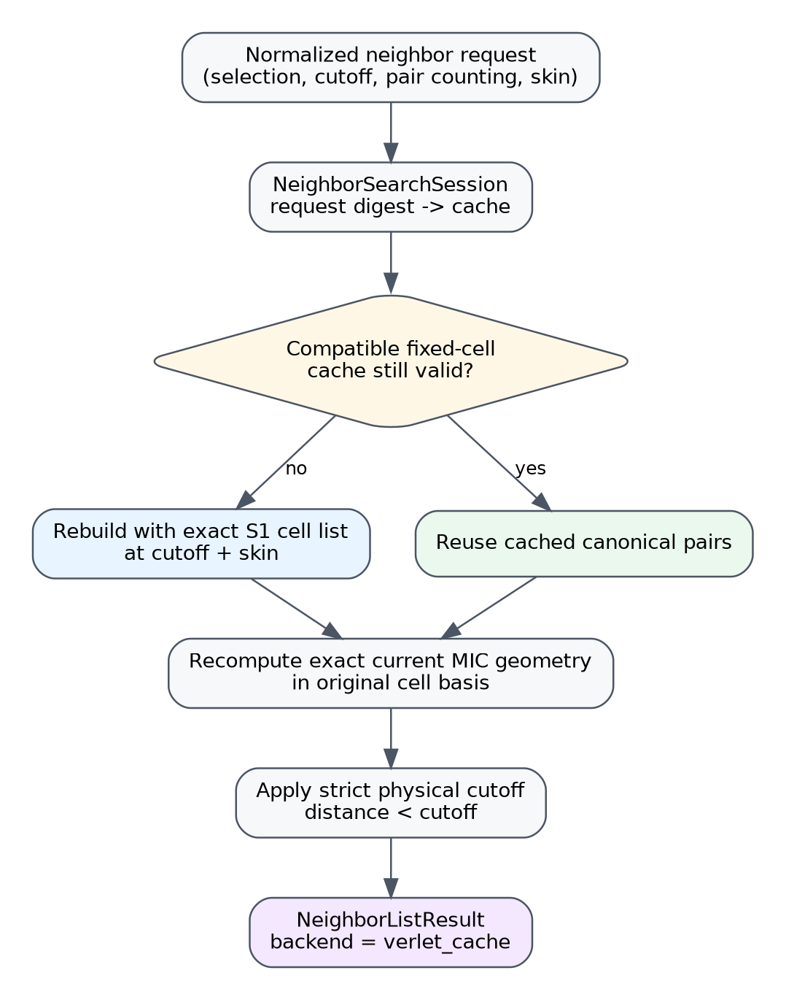
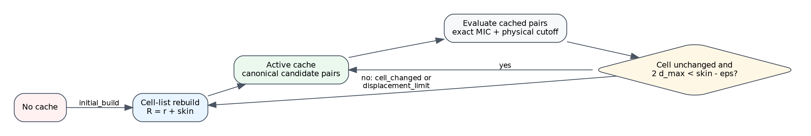

# Purpose and implementation status

This document is the normative design and implementation specification for the
stage S2 fixed-cell Verlet candidate cache in `mdstats`.

The implementation lives in:

```text
mdstats/analysis/_verlet_cache.py
```

and uses the exact S1 triclinic cell-list backend in:

```text
mdstats/analysis/_cell_list.py
```

Package version:

```text
0.14.0a2
```

Stage S2 is implemented. It adds request-keyed, fixed-cell candidate reuse and
an explicit `NeighborSearchSession`. This document remains the normative S2
contract. Stage S3 deformation-aware reuse is implemented in package
`0.14.0a3` and is specified separately in
`docs/specs/analysis/_verlet_cache_deformation_spec.md`.
Automatic backend selection and cross-consumer integration are implemented by the S4 policy layer; this document remains the normative fixed-cell cache specification.

The session is available through the public package namespace:

```python
from mdstats import (
    NeighborCacheStatistics,
    NeighborSearchSession,
    VerletCacheOptions,
    VerletPairCache,
)
```

The scientific result continues to use the existing `NeighborListResult`
contract. A result produced by the session records:

```python
NeighborSearchBackend.VERLET_CACHE
```

as provenance. `VERLET_CACHE` is not a valid selection for the stateless
`build_neighbor_list()` function; persistent reuse requires a session.

# Scope

## Included

Stage S2 provides:

- one immutable candidate cache per normalized request digest;
- candidate construction at `physical cutoff + skin` using the exact S1 cell
  list;
- exact current-frame minimum-image geometry for every cached pair;
- strict physical filtering by `distance < cutoff`;
- the fixed-cell rebuild condition

  $$
  2d_{\max}\ge r_{\mathrm{skin}}-\varepsilon;
  $$

- conservative invalidation on any cell-matrix change;
- reference-relative periodic displacement tracking;
- noncontiguous frame evaluation relative to the stored rebuild frame;
- explicit cache statistics and rebuild reasons;
- opt-in atomic-connectivity integration;
- single-pass hysteretic formation/breaking classification;
- single-pass reference formation/retention classification;
- permanent dense and stateless cell-list reference paths.

## Excluded

Stage S2 does not provide:

- cache reuse under a changed cell matrix;
- singular-value deformation bounds;
- species-resolved nonaffine displacement margins;
- automatic dense/cell-list/Verlet backend selection;
- cache sharing between compatible but nonidentical requests;
- a global cache service shared by unrelated analyses;
- parallel or thread-safe session mutation;
- multiple periodic images of one atom pair beyond the existing unique-image
  contract;
- consumer integration for RDF, coordination, or bond-angle analysis.

The fixed-cell restriction is intentional. Any cell change triggers a rebuild.
Stage S3 will replace only this conservative invalidation rule; it will not
change candidate identity or output semantics.

# Algorithmic provenance and attribution boundary

The enlarged candidate radius and repeated physical-cutoff filtering follow the
classical Verlet-list construction [1]. The automatic fixed-cell update logic,
in which relative endpoint motion is bounded by the sum of two
reference-relative displacement maxima, is closely associated with the
analysis of Chialvo and Debenedetti [2].

Candidate rebuilds use the S1 linked-cell backend, whose historical foundation
is Quentrec and Brot [3] and whose general parallelepiped context includes Cui,
Sun, and Qu [4].

The request digest, immutable per-request cache object, deterministic CSR
candidate storage, strict equality-rebuild policy, and integration with mdstats
connectivity requests are package-specific engineering and correctness choices.
The cited works are not claimed as sources for those details.

# Ownership boundary

{ width=80% }

Scientific modules specify the neighbor request. The session owns all cache
mechanics.

A consumer supplies:

- center atom indices;
- candidate atom indices;
- pair-counting semantics;
- physical cutoff;
- frame index.

The session owns:

- request normalization and hashing;
- list-radius construction;
- cell-list rebuilds;
- reference positions and cell;
- displacement bounds;
- cache compatibility;
- candidate evaluation;
- statistics and rebuild reasons.

Consumers must not manually decide when a cache is valid.

# Coordinate and minimum-image conventions

## Row-vector cell convention

The cell matrix contains lattice vectors as rows:

$$
H=
\begin{pmatrix}
\mathbf a^{\mathsf T}\\
\mathbf b^{\mathsf T}\\
\mathbf c^{\mathsf T}
\end{pmatrix},
$$

and fractional row vectors map to Cartesian coordinates by

$$
\mathbf r=\mathbf sH.
$$

For one atom pair, the reported minimum-image vector obeys

$$
\mathbf d_{ij}^{\mathrm{MIC}}
=
\mathbf r_j-\mathbf r_i+\mathbf m_{ij}H,
$$

where the integer image shift $\mathbf m_{ij}$ is zero along nonperiodic axes.

## Authoritative current-frame geometry

A cached image shift is never authoritative. On every session evaluation,
including reuse frames, current vectors, distances, and image shifts are
recomputed through the shared minimum-image routine in the original physical
cell basis.

This requirement permits atoms to cross periodic boundaries and permits the
identity of the closest periodic image to change while the cache remains valid.

# Candidate radius and completeness

For one physical cutoff $r_c$ and skin $r_s>0$, define

$$
R=r_c+r_s.
$$

This is the classical buffered Verlet-list construction [1].

At a rebuild frame $t_0$, the exact S1 cell list stores every canonical request
pair satisfying

$$
r_{ij}(t_0)<R.
$$

The cache may contain pairs outside the physical cutoff. They are retained so
that they can enter the physical neighborhood before the next rebuild.

The result returned to the scientific consumer still uses only

$$
r_{ij}(t)<r_c.
$$

The strict inequality is unchanged from the dense and S1 backends.

## Unique-image validation

The list radius, not only the physical cutoff, must satisfy the existing
conservative minimum-image safety contract. The implementation validates

$$
R<\frac12\min_{\alpha\in\mathrm{PBC}}h_\alpha,
$$

up to the existing numerical tolerance, where $h_\alpha$ is the perpendicular
cell height for periodic axis $\alpha$.

A physical cutoff may therefore be individually valid while its selected skin
is too large. In that case the session raises `UnsafeNeighborCutoffError`; it
does not silently reduce the skin.

# Fixed-cell validity proof

At rebuild time, every omitted pair satisfies

$$
r_{ij}(t_0)\ge r_c+r_s.
$$

Let each atom move by no more than $d_{\max}$ from the rebuild reference, after
periodic equivalence is accounted for. The pair separation can shrink by at
most the sum of the endpoint displacements:

$$
\left|r_{ij}(t)-r_{ij}(t_0)\right|
\le d_i+d_j
\le 2d_{\max}.
$$

Therefore, while

$$
2d_{\max}<r_s,
$$

an omitted pair cannot cross from outside $r_c+r_s$ to inside $r_c$.

The implemented numerical criterion is conservative:

$$
\boxed{
2d_{\max}\ge r_s-\varepsilon
\quad\Longrightarrow\quad
\text{rebuild}
}
$$

where $\varepsilon$ is `VerletCacheOptions.safety_tolerance`.

Equality triggers a rebuild.

This displacement-triggered criterion is the conservative half-skin form of
automatic Verlet-list rebuilding [2].

# Reference-relative displacement tracking

The session stores wrapped Cartesian positions for the union of center and
candidate selections at the rebuild frame.

For a current frame, it forms

$$
\Delta\mathbf r_i
=
\mathbf r_i(t)-\mathbf r_i(t_0)
$$

and reduces this displacement with the same minimum-image operation under the
reference fixed cell. Then

$$
d_{\max}
=
\max_i\left\|\Delta\mathbf r_i^{\mathrm{MIC}}\right\|.
$$

This construction is robust to ordinary periodic boundary crossings. An atom
moving from a wrapped coordinate near one side of the cell to the opposite side
is assigned its small physical periodic displacement rather than a cell-length
jump.

The validity check is reference-relative, not step-relative. Frames may be
evaluated noncontiguously and in any order. The cache remains valid only if the
current frame satisfies the bound relative to the most recent rebuild frame.

For an independent ensemble, the same periodic-equivalence bound is
mathematically meaningful, but a cache may rebuild frequently because frames
need not be close. S2 does not require trajectory semantics at the session
level.

# Cell policy

Stage S2 permits reuse only when the current cell matrix is exactly equal to the
stored reference cell matrix under NumPy array equality.

Any difference causes the rebuild reason:

```text
cell_changed
```

The session validates the new frame and rebuilds using the S1 cell list. This
policy is safe but intentionally conservative for NPT and strained trajectories.

No tolerance-based deformation reuse is claimed. Stage S3 will introduce the
accepted singular-value bound and species-aware nonaffine displacement margin.

# Normalized request identity

A session owns one cache per exact request digest. The request digest uses
SHA-256 over canonical JSON containing:

- request schema version;
- atom count;
- atomic numbers at canonical indices;
- PBC flags;
- center atom indices in request order;
- candidate atom indices in request order;
- pair-counting mode;
- exact hexadecimal physical cutoff;
- exact hexadecimal skin;
- exact hexadecimal safety tolerance;
- all `CellListOptions` fields.

The schema constant is:

```python
VERLET_REQUEST_SCHEMA = "mdstats.verlet-request.v1"
```

The digest deliberately excludes frame coordinates and the cell matrix. Those
are cache state and validity inputs, not scientific request identity.

A changed cutoff, selection, pair-counting mode, skin, tolerance, PBC schema,
atomic-number schema, or cell-list option creates a separate cache.

S2 does not attempt superset cache reuse. For example, a cache at 4 A does not
serve a request at 3 A unless both requests are exactly identical under the
request schema.

# Public and internal API

## `VerletCacheOptions`

```python
@dataclass(frozen=True, slots=True)
class VerletCacheOptions:
    skin: float = 0.5
    safety_tolerance: float = 1.0e-12
    cell_list_options: CellListOptions = CellListOptions()
```

Constraints:

- `skin` must be positive and finite;
- `safety_tolerance` must be finite and nonnegative;
- `safety_tolerance < skin`;
- `cell_list_options` must be a `CellListOptions` instance.

`to_dict()` returns a JSON-compatible configuration summary.

## `VerletPairCache`

```python
@dataclass(frozen=True, slots=True)
class VerletPairCache:
    request_digest: str
    reference_frame_index: int
    selected_atom_indices: NDArray[np.int64]
    reference_wrapped_positions: NDArray[np.float64]
    reference_cell: NDArray[np.float64]
    center_indices: NDArray[np.int64]
    candidate_neighbor_indices: NDArray[np.int64]
    candidate_offsets: NDArray[np.int64]
    physical_cutoff: float
    list_cutoff: float
    pair_counting: PairCounting
    skin: float
    canonical_schema_version: str
```

The canonical cache schema is:

```python
VERLET_CACHE_SCHEMA = "mdstats.verlet-cache.v1"
```

All NumPy arrays are defensive copies and read-only.

The cache stores candidates in the same center-row CSR organization used by
`NeighborListResult`. It does not store current vectors, distances, or image
shifts because those are recomputed on every frame.

`summary()` returns a compact JSON-compatible description without serializing
full coordinates or pair arrays.

## `NeighborSearchSession`

```python
session = NeighborSearchSession(
    collection,
    VerletCacheOptions(skin=0.5),
)
```

Primary method:

```python
result = session.build_neighbor_list(
    frame_index=frame,
    center_indices=centers,
    candidate_neighbor_indices=candidates,
    cutoff=cutoff,
    pair_counting=PairCounting.DIRECTED,
)
```

Inspection API:

```python
session.n_caches
session.request_digests
session.statistics()
session.statistics(request_digest)
session.cache_for_request(request_digest)
session.clear()
```

The session is mutable and intentionally not thread-safe. Use an independent
session per parallel worker.

## `NeighborCacheStatistics`

```python
@dataclass(frozen=True, slots=True)
class NeighborCacheStatistics:
    evaluations: int
    rebuilds: int
    reuse_evaluations: int
    candidate_pair_evaluations: int
    accepted_pairs: int
    current_candidate_pairs: int
    rebuild_reasons: tuple[tuple[str, int], ...]
```

Derived metrics:

```python
mean_evaluations_per_rebuild
acceptance_ratio
```

`to_dict()` produces a JSON-compatible report.

# Cache lifecycle

{ width=86% }

For one request and frame:

```text
1. Normalize and validate the request.
2. Validate the physical cutoff.
3. Validate cutoff + skin.
4. Compute the request digest.
5. Look up the request cache.
6. Rebuild if absent.
7. Rebuild if the cell matrix changed.
8. Otherwise compute d_max from the rebuild reference.
9. Rebuild if 2 d_max >= skin - tolerance.
10. Evaluate exact current MIC geometry for cached candidates.
11. Apply the strict physical cutoff.
12. Update statistics and return NeighborListResult.
```

Rebuild reasons implemented in S2 are:

```text
initial_build
displacement_limit
cell_changed
```

Request changes create a new request cache and therefore an `initial_build` for
that digest.

# Candidate rebuild algorithm

A rebuild invokes the S1 cell-list backend with

$$
R=r_c+r_s.
$$

The returned S1 result is already:

- candidate-complete under the supported minimum-image regime;
- deterministic;
- grouped by center row;
- filtered to the strict list radius;
- free of self pairs;
- consistent with directed or unordered-identical counting.

The cache stores only:

- center rows;
- candidate neighbor indices;
- CSR offsets;
- request and reference metadata.

The candidate-result vectors and distances are intentionally discarded. They
would become stale immediately and must not be reused as current geometry.

# Reuse-frame evaluation

For each center row, the session retrieves its cached candidate atoms, computes
current raw Cartesian displacements, applies exact current-frame MIC geometry,
and filters by the physical cutoff.

Conceptual pseudocode:

```text
for each center row i:
    J = cached candidate atoms for i
    raw = positions[J] - positions[i]
    vectors, distances, shifts = exact_mic(raw, current_cell, pbc)
    keep = distances < physical_cutoff
    append kept entries to output CSR row
```

Coincident distinct atoms inside the physical cutoff raise the existing
`CoincidentAtomsError`.

The result preserves:

- original center order;
- cached candidate order inside each center row;
- exact image shifts in the original cell basis;
- strict cutoff semantics;
- immutable result arrays.

# Atomic-connectivity integration

`compute_atomic_connectivity()` now accepts:

```python
verlet_cache_options: VerletCacheOptions | None = None
```

When supplied, one `NeighborSearchSession` is created for the full operation and
reused across selected frames and registered species-pair requests.

Example:

```python
result = compute_atomic_connectivity(
    collection,
    definition,
    verlet_cache_options=VerletCacheOptions(skin=0.6),
)
```

The final `AtomicConnectivityResult.metadata` records a JSON-compatible
`neighbor_cache` statistics object. Without cache options, this metadata entry
is `None`.

No atomic graph identity, canonical gauge, digest, state catalog, segment, or
transition semantics are changed.

## Single-pass hysteresis

For each registered pair type, S2 evaluates one outer result at the breaking
cutoff:

$$
r<r_{\mathrm{break}}.
$$

The formation subset is selected from the same distances using

$$
r<r_{\mathrm{form}}.
$$

Previously bonded pairs are retained from the outer set; previously absent
pairs are added only from the inner set.

The geometric candidate cache and bond-history state remain separate.

## Single-pass reference connectivity

For reference connectivity, the retention cutoff is the outer result. Discovery
or formation subsets are selected from the same current distances.

Given

$$
r_{\mathrm{form}}\le r_{\mathrm{discover}}<r_{\mathrm{retain}},
$$

one retention-distance pass is sufficient to classify all three thresholds.

# Correctness invariants

The following are mandatory:

1. Every cached result equals a fresh dense result and a fresh S1 cell-list
   result for the same frame and physical request.
2. Candidate construction uses the list radius, not the physical cutoff.
3. Result filtering uses the physical cutoff, not the list radius.
4. Current MIC vectors and image shifts are recomputed on every frame.
5. Equality at the displacement threshold forces a rebuild.
6. Any cell-matrix change forces a rebuild in S2.
7. Request changes cannot reuse an incompatible cache.
8. Result arrays and cache arrays are immutable.
9. Hysteretic bond history is not stored in `VerletPairCache`.
10. Dense and stateless cell-list paths remain available.

# Complexity

Let $P$ be the number of cached candidate pairs.

A rebuild costs the exact S1 cell-list construction plus candidate geometry:

$$
T_{\mathrm{rebuild}}
\sim O(N+P)
$$

at fixed density and finite list radius, subject to stencil overhead.

A reuse frame costs:

$$
T_{\mathrm{reuse}}
\sim O(P).
$$

If a cache survives $K$ evaluations, the amortized cost is approximately

$$
\frac{T_{\mathrm{rebuild}}}{K}+T_{\mathrm{reuse}}.
$$

The cache memory cost is

$$
O(N_{\mathrm{selected}}+P),
$$

for reference positions and CSR candidate arrays.

A large skin increases $P$ but may increase $K$. A small skin reduces $P$ but
causes more frequent rebuilds.

# Failure and edge cases

## Skin too large for the cell

If `cutoff + skin` exceeds the supported unique-image radius, the request fails
explicitly with `UnsafeNeighborCutoffError`.

## Cell change

The cache is rebuilt. It is not reused under an approximate equality tolerance.

## Large displacement

The cache is rebuilt at or before the accepted threshold. A large frame jump is
safe but may eliminate reuse.

## Periodic boundary crossing

Reference-relative MIC displacement prevents a false cell-length jump.

## Noncontiguous frame order

Validity is checked against the rebuild reference, so noncontiguous access is
supported. A backward or forward jump may trigger a rebuild.

## Coincident atoms

Distinct cached atoms becoming coincident inside the physical cutoff raise the
same error as fresh search.

## Empty physical result

A cache may contain candidates while the physical result has zero pairs. This
is valid and required for future entering-cutoff events.

## Request proliferation

Every exact request digest owns an independent cache. S2 provides no automatic
cache eviction. A long-lived session with many unique requests may accumulate
memory. Scientific operations should use bounded request sets or clear the
session when complete.

## Threading

One session must not be mutated concurrently. Parallel workers require separate
sessions.

# Acceptance test matrix

Stage S2 tests cover:

- fixed-cell solid-like motion with one rebuild;
- diffusive motion with repeated rebuilds;
- a cached pair entering the physical cutoff before rebuild;
- an omitted pair approaching the cutoff without violating the skin bound;
- exact threshold equality;
- periodic boundary crossings;
- noncontiguous frame evaluation;
- conservative cell-change rebuilds;
- independent request-keyed caches;
- list-radius unique-image rejection;
- randomized triclinic trajectories;
- read-only cache arrays;
- stateless-facade rejection of `VERLET_CACHE` selection;
- cached distance connectivity versus uncached connectivity;
- cached hysteretic connectivity versus uncached connectivity;
- cached reference connectivity versus uncached connectivity;
- one outer distance evaluation per hysteretic frame and pair type.

Every cached frame is compared against both:

```text
fresh dense result
fresh cell-list result
```

using the S0 canonical comparison utilities.

# Benchmark result

The reproducible benchmark is:

```text
benchmarks/verlet_cache_benchmark.py
benchmarks/verlet_cache_benchmark.json
```

It evaluates 12-frame fixed-cell triclinic systems with 64, 128, and 256 atoms
under solid-like and more diffusive motion.

On the recorded machine, all frame results passed fresh cell-list equivalence.
Observed illustrative speedups were:

| Motion | Atoms | Rebuilds | Reuse evaluations | Speedup vs fresh cell list |
|---|---:|---:|---:|---:|
| solid | 64 | 1 | 11 | 6.28x |
| solid | 128 | 1 | 11 | 5.06x |
| solid | 256 | 1 | 11 | 4.29x |
| diffusive | 64 | 3 | 9 | 2.81x |
| diffusive | 128 | 3 | 9 | 2.63x |
| diffusive | 256 | 3 | 9 | 2.36x |

These timings are machine- and fixture-specific. They demonstrate reuse, not a
universal performance guarantee. The S4 policy uses a conservative measured crossover and remains explicitly overrideable.

# Implementation map

| Concern | Implementation |
|---|---|
| Fixed-cell cache objects and session | `mdstats/analysis/_verlet_cache.py` |
| Dense and result contract | `mdstats/analysis/_neighbors.py` |
| Exact candidate rebuild | `mdstats/analysis/_cell_list.py` |
| Oracle comparison | `mdstats/analysis/_neighbor_compare.py` |
| Atomic integration and nested thresholds | `mdstats/analysis/atomic_connectivity.py` |
| Focused cache tests | `tests/test_verlet_cache.py` |
| Connectivity integration tests | `tests/test_atomic_connectivity.py` |
| Benchmark | `benchmarks/verlet_cache_benchmark.py` |

# Subsequent stages

## Stage S3

S3 is implemented in `0.14.0a3` as an explicit option and preserves all S2
request, candidate, and result contracts. Its normative formula, trajectory
coordinate requirements, condition-number guard, and tests are specified in:

```text
docs/specs/analysis/_verlet_cache_deformation_spec.md
```

The default options still apply the S2 fixed-cell policy.

## Stage S4

S4 is implemented in `0.14.0`. RDF, coordination, bond angle, and distance-based connectivity now share `NeighborSearchOptions`, one analysis-local executor, conservative automatic selection, exact fallback, and unified diagnostics. The normative production contract is `docs/specs/analysis/neighbor_search_spec.md`.

# Definition of done

Stage S2 is complete only when:

- the fixed-cell proof is implemented exactly;
- list-radius safety is validated;
- current MIC geometry is recomputed for cached pairs;
- all focused and complete regression tests pass;
- cached connectivity matches uncached canonical graph states;
- cache statistics are exposed and documented;
- Markdown and PDF specifications match source signatures and behavior;
- the wheel and source distribution contain the new module, tests, benchmark,
  and specification;
- the low-level `VerletCacheOptions` default remains fixed-cell S2 behavior; the S4 high-level policy explicitly enables deformation-aware reuse and preserves exact overrides.

# References

1. Verlet, L. (1967). *Computer "Experiments" on Classical Fluids. I.
   Thermodynamical Properties of Lennard-Jones Molecules*. Physical Review,
   159(1), 98-103. DOI: 10.1103/PhysRev.159.98.
2. Chialvo, A. A., and Debenedetti, P. G. (1990). *On the Use of the Verlet
   Neighbor List in Molecular Dynamics*. Computer Physics Communications,
   60(2), 215-224. DOI: 10.1016/0010-4655(90)90007-N.
3. Quentrec, B., and Brot, C. (1973). *New Method for Searching for Neighbors
   in Molecular Dynamics Computations*. Journal of Computational Physics,
   13(3), 430-432. DOI: 10.1016/0021-9991(73)90046-6.
4. Cui, Z., Sun, Y., and Qu, J. (2009). *The Neighbor List Algorithm for a
   Parallelepiped Box in Molecular Dynamics Simulations*. Chinese Science
   Bulletin, 54(9), 1463-1469. DOI: 10.1007/s11434-009-0197-0.
